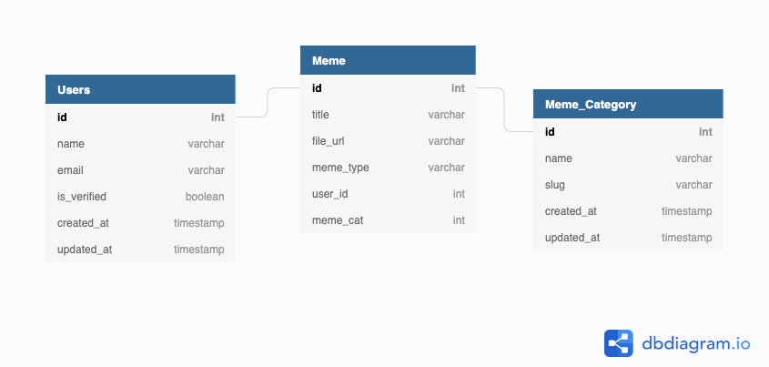

# memefy-backend

## The Backend  Service for a meme sharing paltform

# Database Diagram
 

# Built with 
-  Django 3
-  Python 3
-  Django Rest Framework
-  Cloudinary image library

# To run
- git clone repo
- python3  manage.py makemigrations
- python3  manage.py migrate
